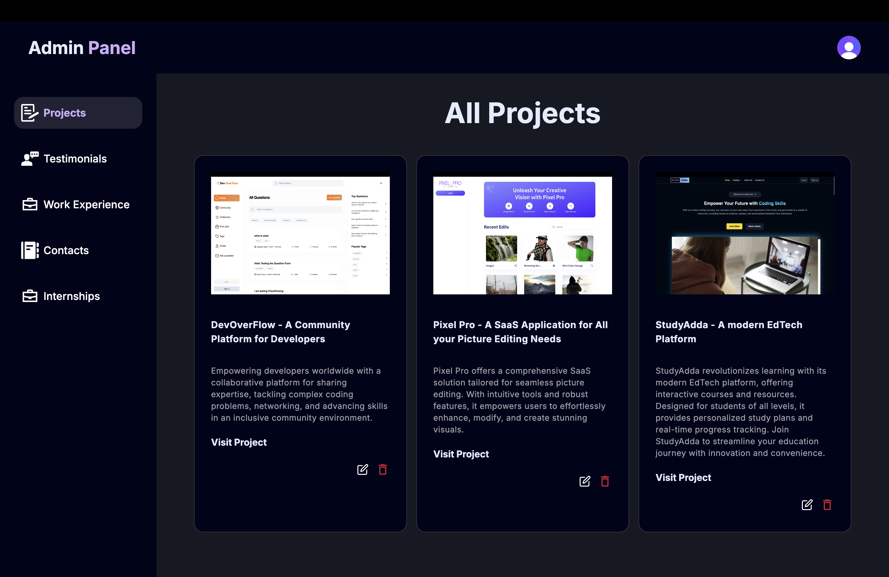

<!-- PROJECT TITLE -->

# My Portfolio Website

A personal portfolio showcasing my projects, skills, and work experience, built using **Next.js**, **MongoDB**, **Clerk** for authentication, and **Cloudinary** for image handling.

## About The Project

### Home Page


### Alternative Home Page View


### Dashboard Page



This portfolio is designed to provide an online presence and showcase my development projects. The key technologies used are Next.js, MongoDB for backend storage, Clerk for authentication, and Cloudinary for image uploads and management.

### Key Features

- **Modern Technologies**: Utilizes Next.js for server-side rendering and MongoDB for a flexible database solution.
- **Authentication**: Integrated with Clerk for secure authentication.
- **Media Management**: Cloudinary handles all media uploads efficiently.
- **Scalable Design**: Built with scalability and maintainability in mind, featuring modular components and a well-structured codebase.

**Check out the live portfolio:** [Manpreet's Portfolio](https://manpreets-portfolio.vercel.app/)

## Built With

- [](https://nextjs.org/)
- [](https://www.mongodb.com/)
- [](https://cloudinary.com/)
- [](https://shadcn.com/)

## Getting Started

To get a local copy up and running, follow these steps.

### Prerequisites

Ensure you have **Node.js** and **npm** installed. To install npm, use the following command:

```sh
npm install npm@latest -g
```

## Installation

To get a local copy up and running, follow these simple steps:

1. **Clone the repo**:

   ```sh
   git clone https://github.com/Manpreet3033/Portfolio_2024.git
   ```

2. **Navigate into the project directory**:

   ```sh
   cd portfolio_2024
   ```

3. **Install the required NPM packages**:

   ```sh
   npm install
   ```

4. **Set up your environment variables. Create a `sh .env.local` file in the root directory and add the following environment variables:**:

   ```sh
   NEXT_PUBLIC_CLERK_PUBLISHABLE_KEY=your_clerk_publishable_key
   CLERK_SECRET_KEY=your_clerk_secret_key
   NEXT_PUBLIC_CLERK_SIGN_IN_URL=/sign-in
   NEXT_PUBLIC_CLERK_SIGN_UP_URL=/sign-up
   NEXT_PUBLIC_CLERK_AFTER_SIGN_IN_URL=/dashboard/projects
   NEXT_PUBLIC_CLERK_AFTER_SIGN_UP_URL=/
   MONGODB_URL=your_mongodb_url
   NEXT_PUBLIC_CLOUDINARY_CLOUD_NAME=your_cloudinary_cloud_name
   NEXT_PUBLIC_CLOUDINARY_API_KEY=your_cloudinary_api_key
   CLOUDINARY_API_SECRET=your_cloudinary_api_secret
   EMAIL=your_email
   EMAIL_PASSWORD=your_email_password
   ```

5. **Start the development server**:
   ```sh
   npm run dev
   ```
